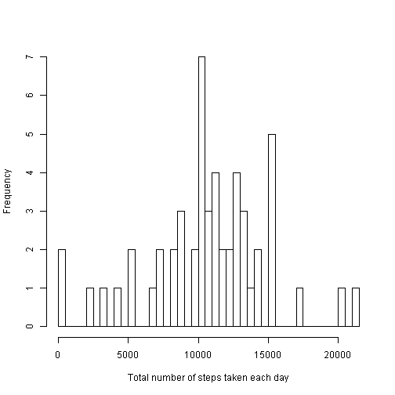
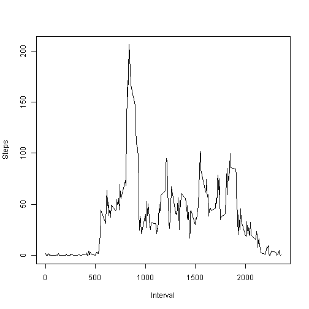
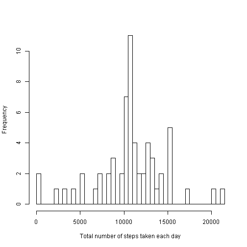
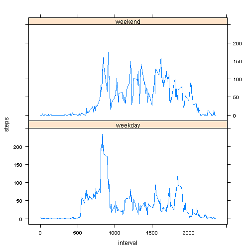

# Reproducible Research: Peer Assessment 1

## Loading and preprocessing the data


```r
rawData <- read.csv('activity.csv')
rawData$date <- as.Date(rawData$date, format = '%Y-%m-%d')
data <- rawData[!is.na(rawData$steps),]
```

## What is mean total number of steps taken per day?


```r
stepsPerDay <- aggregate(steps ~ date, data, sum)$steps
hist(stepsPerDay, breaks = 50, main = '', xlab = 'Total number of steps taken each day')
```

 

```r
as.character(mean(stepsPerDay)) #because on my computer knitr produces rounded result
```

[1] "10766.1886792453"

```r
as.character(median(stepsPerDay)) #because on my computer knitr produces rounded result
```

[1] "10765"

## What is the average daily activity pattern?


```r
averageDailyActivity <- aggregate(steps ~ interval, data, mean)
plot(averageDailyActivity$interval, averageDailyActivity$steps, type = 'l', xlab = 'Interval', ylab = 'Steps')
```

 

```r
subset(averageDailyActivity, steps == max(steps))$interval
```

```
## [1] 835
```

## Imputing missing values

Let's impute missing values by the mean for that 5-minute interval.


```r
sum(is.na(rawData$steps))
```

[1] 2304

```r
imputedData <- rawData
na <- is.na(imputedData$steps)
imputedData$steps[na] <- averageDailyActivity$steps[
    match(imputedData$interval[na], averageDailyActivity$interval)]
stepsPerDay <- aggregate(steps ~ date, imputedData, sum)$steps
hist(stepsPerDay, breaks = 50, main = '', xlab = 'Total number of steps taken each day')
```

 

```r
as.character(mean(stepsPerDay)) #because on my computer knitr produces rounded result
```

[1] "10766.1886792453"

```r
as.character(median(stepsPerDay)) #because on my computer knitr produces rounded result
```

[1] "10766.1886792453"

We can see that imputing missing values changes median, but not mean.

## Are there differences in activity patterns between weekdays and weekends?


```r
weekend <- as.POSIXlt(data$date)$wday %in% c(0, 6)
data$weekend <- factor(weekend, labels = c('weekday', 'weekend'))
averageWeekday <- aggregate(steps ~ interval + weekend, data, mean)
library(lattice);
xyplot(steps ~ interval | weekend, data = averageWeekday, 
       type = 'l', layout = c(1, 2))
```

 

